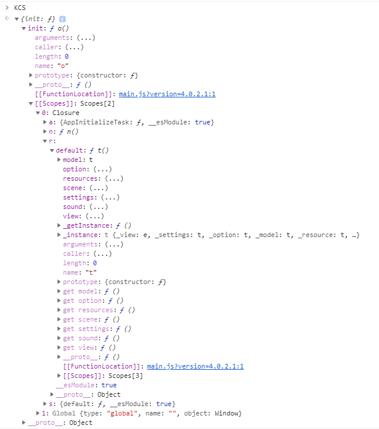

# KanColleSource

The source code of KanColle HTML5 version is written in `Typescript` and bundled by `webpack`.

## Description

For my own curiosity and the demand of reviewing ES5, this repo is built, trying to analyse bundled code of game *KanColle*.

It's difficult to check diff between two versions of `webpack` bundled file:

1. `main.js` is large and difficult to do analysis for the whole file.
2. So the only way is to divide `main.js` into modules and read code in each file. But it will be annoying to check diff 
because of the implementation of `webpack`, which turn modules into an array, implying that the change of modules will lead 
to the change of array we get, and we cannot find a better way to organize the elements of this array.

For the reasons above, I will only do analysis for a certain version (maybe `4.1.1.6`) until a better idea is brought up.

## Folder structure

    KanColleSource/
    ├── analysis/             - my comments to make it easy to understand
    ├── assets/
    ├── functions/            - chunked functions
    ├── utils/
    │   ├── chunker.js        - helper function to chunk `../main.js`
    │   ├── detector.js       - detect version change
    │   └── searcher.js       - search dependency relationship and generate json
    ├── .gitignore
    ├── main.js               - formatted code
    ├── raw.js                - original source code
    ├── tree.json             - dependency tree
    ├── package.json
    └── README.md

## View in Google Chrome

Generally, we can find the source code in `Source` or `Application` tab,

but it is too large and hard for us to analyse it.

Luckily, `main.js` sets a global variable `KCS`,

and we can access it in console by toggling `top` to `index.php`.

Type `KCS` and we will get a object: `{init: o}`(`o` is the init function),

which is the only one interface `main.js` exposes.

Luckily again, we can access the [[Scopes\]\] of `o` thanks to Chrome,

then we can get *EVERYTHING* recursively.

It is helpful to us to analyse the mass bundled code.

## Reference links

[api information by 74EO](https://github.com/andanteyk/ElectronicObserver/blob/develop/ElectronicObserver/Other/Information/apilist.txt)

[api_start2 by Tibo442](https://github.com/Tibo442/api_start2)